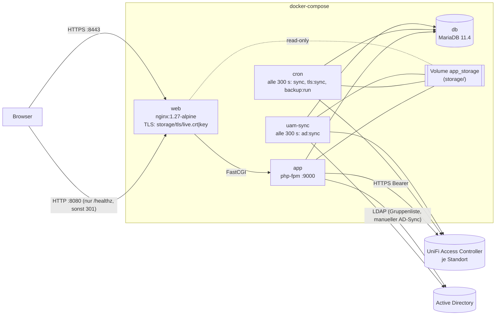
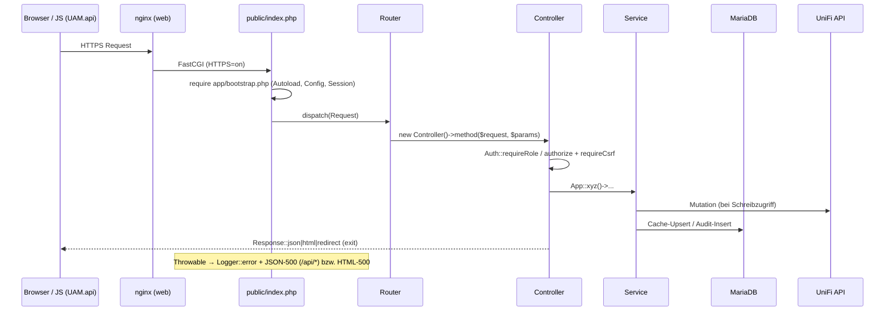
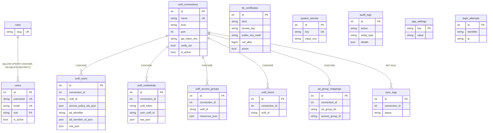
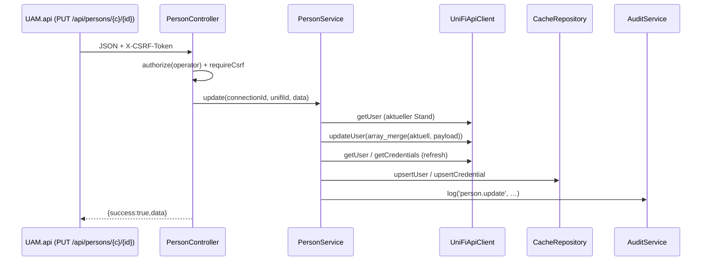
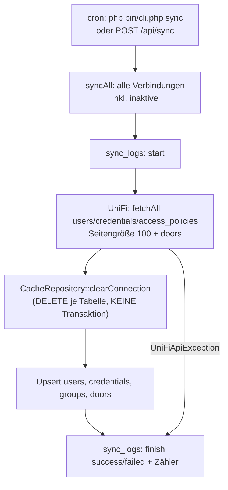
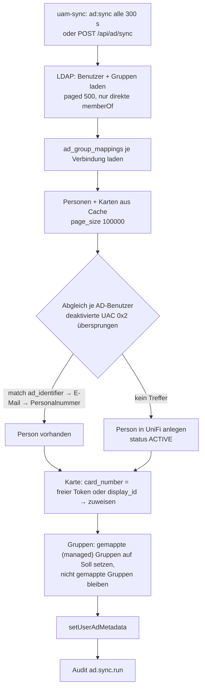
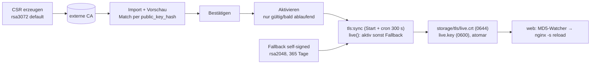

# agentsindex.md – Wissensbasis für Coding-Agents

> **Zweck:** Diese Datei ist der Einstiegspunkt für KI-Coding-Agents und neue
> Entwickler. Sie beschreibt Architektur, Datenflüsse, Invarianten,
> Gefahrenstellen und Arbeitsregeln des Repositorys `dareinelt/accessmanager`
> („UniFi Access Manager“).
>
> **Stand:** erstellt durch Code-Analyse von Commit `7f994fa` (Merge PR #7).
> Alle Aussagen beziehen sich auf diesen Stand.
>
> **Kennzeichnung der Aussagen**
>
> - **[Fakt]** – direkt im Code/in der Konfiguration nachweisbar (Datei angegeben).
> - **[Abgeleitet]** – logische Folgerung aus mehreren Fakten, nicht explizit dokumentiert.
> - **[Annahme]** – plausible Vermutung ohne Beleg im Repo.
> - **[Unklar]** – widersprüchlich oder nicht ermittelbar → siehe [Offene Fragen](#25-offene-fragen).
>
> Aussagen ohne Kennzeichnung in Tabellen/Listen sind **[Fakt]**.

---

## Inhaltsverzeichnis

1. [Projektüberblick](#1-projektüberblick)
2. [Repository-Struktur](#2-repository-struktur)
3. [Technologie-Stack](#3-technologie-stack)
4. [Architektur](#4-architektur)
5. [Kernkomponenten](#5-kernkomponenten)
6. [Einstiegspunkte](#6-einstiegspunkte)
7. [Datenmodell](#7-datenmodell)
8. [Datenflüsse](#8-datenflüsse)
9. [Geschäftslogik](#9-geschäftslogik)
10. [APIs & Integrationen](#10-apis--integrationen)
11. [Konfiguration](#11-konfiguration)
12. [Authentifizierung & Autorisierung](#12-authentifizierung--autorisierung)
13. [Fehlerbehandlung](#13-fehlerbehandlung)
14. [Logging & Audit](#14-logging--audit)
15. [Tests](#15-tests)
16. [Build & lokale Entwicklung](#16-build--lokale-entwicklung)
17. [CI/CD](#17-cicd)
18. [Wichtige Invarianten](#18-wichtige-invarianten)
19. [Gefahrenzonen](#19-gefahrenzonen)
20. [Change Map – wo ändere ich was?](#20-change-map--wo-ändere-ich-was)
21. [Wo zuerst nachsehen?](#21-wo-zuerst-nachsehen)
22. [Technische Schulden & TODOs](#22-technische-schulden--todos)
23. [Architekturentscheidungen](#23-architekturentscheidungen)
24. [Historischer Kontext](#24-historischer-kontext)
25. [Offene Fragen](#25-offene-fragen)
26. [Arbeitsregeln für Agents](#26-arbeitsregeln-für-agents)

---

## 1. Projektüberblick

**[Fakt]** Webanwendung zur zentralen Verwaltung von **UniFi Access** über
mehrere Standorte (= mehrere lokale UniFi-Access-Controller). Funktionen
(`README.md`, `public/index.php`):

- Personen (UniFi-„Users“) anlegen, bearbeiten, löschen; Status, PIN, Personalnummer.
- NFC-Karten (Credentials) zuweisen/trennen.
- Zutrittsgruppen (UniFi „Access Policies“) verwalten und Personen zuordnen.
- Türen anzeigen und ferngesteuert öffnen.
- Standorte (Controller-Verbindungen inkl. verschlüsseltem API-Token) verwalten.
- Periodische **Synchronisation** UniFi → lokaler DB-Cache.
- **Active-Directory-Integration**: AD-Gruppen → Zutrittsgruppen, automatische
  Personenanlage, Kartenzuweisung, Drift-Report.
- Anwendungsbenutzer mit Rollen `sysadmin` > `admin` > `operator` > `readonly`.
- Audit-Log, CSV-Exporte, Backup/Restore, HTTPS-Zertifikatsverwaltung (CSR/Import/Fallback),
  verschlüsselter Systemgeheimnis-Tresor (nur `sysadmin`).

**Zielgruppe:** interne Administration (UI und Doku vollständig auf **Deutsch**).

**Kernprinzip [Fakt]:** UniFi ist die **Source of Truth**. Lesen erfolgt aus dem
lokalen MariaDB-Cache (`unifi_*`-Tabellen), Schreiben immer zuerst über die
UniFi-API, danach wird der betroffene Cache-Eintrag aktualisiert
(`app/Services/PersonService.php`, `app/Services/AccessGroupService.php`).

---

## 2. Repository-Struktur

```text
.
├── app/                         PHP-Anwendung (Namespace App\ → app/, eigener Autoloader)
│   ├── bootstrap.php            Autoloader, Config, Zeitzone, Fehler-Log, Session-Start
│   ├── Api/                     UniFi-Client (echt + Mock), Factory, Interface, Exception
│   ├── Auth/RateLimiter.php     Login-Brute-Force-Schutz
│   ├── Config/Config.php        .env-Parser + Accessoren (db, ldap, unifiMock …)
│   ├── Controllers/             Web-Controller (Page, Auth, Export, Backup, Certificate, Base)
│   │   └── Api/                 JSON-API-Controller (erben von ApiController)
│   ├── Core/                    App (Service-Locator), Router, Request, Response,
│   │                            Session, Database, Logger, View
│   ├── Helpers/helpers.php      e(), base_path(), storage_path(), csrf_field(), …
│   ├── Repositories/            PDO-Datenzugriff (je Tabelle/Thema)
│   ├── Security/                Auth (Rollen), Csrf, Crypto (AES-256-GCM)
│   ├── Services/                Geschäftslogik
│   │   ├── Ldap/                LDAP-Client (echt + Mock), Factory, Interface
│   │   └── Tls/                 TLS-Zertifikatsverwaltung + CertificateInspector
│   └── Views/                   PHP-Templates (layouts/, auth/, pages/, partials/)
├── bin/cli.php                  CLI: migrate, seed, sync, ad:sync, tls:*, backup:run, …
├── database/migrations/         SQL-Migrationen (001, 002, 003_ad_integration, 003_system_secrets)
├── docker/                      app-/web-Entrypoints, nginx.conf
├── docs/                        Fachdoku (architecture, api, database, deployment,
│                                security, unifi-api, user-guide) + screenshots/
├── public/                      Webroot: index.php (alle Routen), assets/css, assets/js
├── storage/                     Laufzeitdaten (logs/, cache/, backups/; tls/ zur Laufzeit)
├── tests/run.php                Abhängigkeitsfreier Test-Runner
├── Dockerfile, docker-compose.yml, .env.example, .dockerignore, .gitattributes, .gitignore
├── README.md
└── bug_report*.md, feature_request*.md, pull_request_template*.md, config.yml
                                 GitHub-Vorlagen – liegen im Repo-Root, NICHT in .github/
```

Hinweise:

- **[Fakt]** Es gibt **keinen** Ordner `database/seeds/`, `public/assets/images/`,
  `app/Controllers/Web/` und **kein** `.github/`-Verzeichnis (frühere Doku-Stände
  behaupteten teils anderes).
- **[Fakt]** `storage/tls/` wird erst zur Laufzeit von `TlsCertificateService::syncDisk()`
  angelegt; `storage/*` ist bis auf `.gitkeep` in `.gitignore`.
- **[Abgeleitet]** Die GitHub-Vorlagen im Root (`config.yml` mit
  `blank_issues_enabled: false`, Issue-/PR-Templates DE+EN) sind an dieser Stelle
  für GitHub wirkungslos (erwartet: `.github/ISSUE_TEMPLATE/`,
  `.github/pull_request_template.md`). Siehe [Offene Fragen](#25-offene-fragen).

---

## 3. Technologie-Stack

| Bereich | Technologie | Beleg |
|---|---|---|
| Sprache | PHP **8.3** (FPM, Alpine); Code nutzt 8.1+-Features (`never`, `readonly`, First-Class-Callables) | `Dockerfile` |
| PHP-Extensions | `pdo_mysql`, `mysqli`, `mbstring`, `gd`, `intl`, `ldap` (+ Standard `openssl`, `curl`, `json`) | `Dockerfile` |
| Framework | **keins** – eigener Router/DI/View | `app/Core/` |
| Paketmanager | **kein Composer, kein npm** | Repo-Root |
| Datenbank | **MariaDB 11.4**, PDO, native Prepared Statements | `docker-compose.yml`, `app/Core/Database.php` |
| Webserver | **nginx 1.27-alpine** (TLS-Terminierung, FastCGI → `app:9000`) | `docker/nginx.conf` |
| Frontend | Server-gerenderte PHP-Views + Vanilla-JS (`window.UAM`) + eigenes CSS, **kein CDN** | `public/assets/` |
| Krypto | OpenSSL (AES-256-GCM, CSR/X.509) | `app/Security/Crypto.php`, `app/Services/Tls/` |
| HTTP-Client | cURL | `app/Api/UniFiApiClient.php` |
| Verzeichnisdienst | ext-ldap (LDAP/LDAPS/StartTLS) | `app/Services/Ldap/LdapService.php` |
| Container | Docker Compose (5 Services) | `docker-compose.yml` |
| Tests | eigener Runner, keine Bibliothek | `tests/run.php` |
| Linter/Formatter/Static Analysis | **keine** konfiguriert | – |

---

## 4. Architektur

### 4.1 Schichten

**[Fakt]** Klassische Schichtenarchitektur ohne Framework:

```text
public/index.php (Front-Controller + Routen)
  → Router → Controller (Web: HTML/Redirect, Api: JSON)
      → Services (Geschäftslogik, Audit)
          → Repositories (PDO/SQL)      → MariaDB
          → UniFiApiClientInterface    → UniFi Access Controller (HTTPS, Bearer)
          → LdapClientInterface        → Active Directory
```

Abhängigkeiten werden **nicht** injiziert, sondern über den statischen
Service-Locator `App\Core\App` (`app/Core/App.php`) lazy erzeugt und pro Prozess
gecacht (`App::persons()`, `App::sync()`, `App::tls()`, …). Repositories werden in
den Services bzw. in `App` per `new` instanziiert.

### 4.2 Container-Topologie



**[Fakt]** (`docker-compose.yml`, `Dockerfile`, `docker/*.sh`):

- `app`, `cron`, `uam-sync` basieren auf demselben Image; der `ENTRYPOINT`
  `docker/app-entrypoint.sh` läuft in **allen drei** Containern (Compose
  `command` ersetzt nur `CMD`): `php bin/cli.php migrate` → `php bin/cli.php tls:sync`
  → `exec "$@"`.
  **[Abgeleitet]** Migrationen und `tls:sync` laufen daher beim Start bis zu
  dreimal parallel.
- `web` wartet in `docker/web-entrypoint.sh` auf `storage/tls/live.crt`/`live.key`
  und lädt nginx neu, sobald sich deren MD5 ändert (Polling alle 5 s).
- `web` mountet `./public` **vom Host** (read-only); `app` hat `public/` und `app/`
  **ins Image kopiert**. **[Abgeleitet]** JS/CSS-Änderungen auf dem Host sind
  sofort sichtbar, PHP-Änderungen erst nach `docker compose build`/`up --build`.
- Volumes: `db_data` (MariaDB), `app_storage` (`/var/www/html/storage`).

### 4.3 Request-Lebenszyklus



---

## 5. Kernkomponenten

| Komponente | Datei(en) | Verantwortung |
|---|---|---|
| Front-Controller & Routen | `public/index.php` | **Alle** Routen (Web, Backup, Zertifikate, Export, API); globaler `try/catch` |
| Bootstrap | `app/bootstrap.php` | Helpers, PSR-4-artiger Autoloader, `Config::load(.env)`, Zeitzone (`APP_TIMEZONE`, Default `Europe/Berlin`), `storage/logs/php-error.log`, `Session::start()` (nicht in CLI) |
| Service-Locator | `app/Core/App.php` | Lazy-Singletons aller Services |
| Router | `app/Core/Router.php` | `{param}` → `[^/]+`, erste Übereinstimmung gewinnt, `_method`/`X-HTTP-Method-Override` für POST, 404 als JSON |
| Request/Response | `app/Core/Request.php`, `app/Core/Response.php` | JSON-Body-Parsing; `Response::*` sind `never` (rufen `exit`) |
| Datenbank | `app/Core/Database.php` | PDO-Singleton, `ERRMODE_EXCEPTION`, `EMULATE_PREPARES=false` |
| Views | `app/Core/View.php`, `app/Views/` | `extract()` + Template + Layout (`layouts/app.php`, `layouts/auth.php`) |
| Auth & Rollen | `app/Security/Auth.php` | Login, Rollen-Rangfolge, `requireLogin/requireRole` |
| CSRF | `app/Security/Csrf.php` | Session-Token, `hash_equals` |
| Krypto | `app/Security/Crypto.php` | AES-256-GCM mit Schlüssel `sha256(APP_SECRET)` |
| Rate-Limit | `app/Auth/RateLimiter.php` | 5 Fehlversuche / 900 s pro Login-Kennung |
| UniFi-Client | `app/Api/UniFiApiClient.php`, `MockUniFiApiClient.php`, `ApiClientFactory.php` | Local-API-Zugriff bzw. Mock mit Datei-State |
| Personen/Karten/Gruppen/Türen | `app/Services/{Person,Credential,AccessGroup,Door}Service.php` | CRUD via UniFi + Cache-Refresh + Audit |
| Standorte | `app/Services/SiteService.php`, `app/Repositories/ConnectionRepository.php` | Controller-Verbindungen, Token-Verschlüsselung, Verbindungstest |
| UniFi-Sync | `app/Services/SyncService.php`, `app/Repositories/CacheRepository.php` | Vollabgleich UniFi → Cache |
| Katalog-Lesezugriff | `app/Repositories/CatalogRepository.php` | Filter/Suche/Paginierung über Cache-Tabellen |
| AD-Integration | `app/Services/AdSyncService.php`, `app/Services/Ldap/*`, `app/Repositories/AdGroupMappingRepository.php` | LDAP lesen, Mapping anwenden, Drift-Report |
| Backup/Restore | `app/Services/BackupService.php`, `app/Repositories/BackupRepository.php`, `app/Controllers/BackupController.php` | JSON-Snapshot, Archiv, Restore |
| TLS | `app/Services/Tls/TlsCertificateService.php`, `CertificateInspector.php`, `app/Controllers/CertificateController.php` | CSR, Import, Aktivierung, Fallback, Export nach `storage/tls/` |
| Systemgeheimnisse | `app/Services/SystemSecretService.php`, `app/Repositories/SystemSecretRepository.php` | Verschlüsselter Tresor (nur sysadmin) |
| Anwendungsbenutzer | `app/Services/AppUserService.php`, `app/Repositories/AppUserRepository.php` | Benutzer/Rollen, Schutz Default-Admin |
| Audit | `app/Services/AuditService.php`, `app/Repositories/AuditRepository.php` | Audit-Einträge |
| Einstellungen | `app/Repositories/SettingsRepository.php`, `app/Controllers/Api/SettingsController.php` | Key/Value in `app_settings` |
| CLI | `bin/cli.php` | Migrationen, Seed, Syncs, TLS, Backup |
| Frontend-JS | `public/assets/js/app.js` | `window.UAM` = `{api, toast, modal, serialize, formObject, csrf}`, deklarative `data-*`-Formulare |

---

## 6. Einstiegspunkte

### 6.1 HTTP – Web-Seiten (HTML)

| Route | Handler | Mindestrolle |
|---|---|---|
| `GET /` | Redirect `/dashboard` | – |
| `GET/POST /login`, `POST /logout` | `AuthController` | – |
| `GET /dashboard`, `/persons`, `/persons/{connection_id}/{unifi_id}`, `/credentials`, `/groups`, `/doors` | `PageController` | readonly (Login) |
| `GET /sync`, `/ad-mappings` | `PageController` | operator |
| `GET /sites`, `/audit`, `/users`, `/settings` | `PageController` | admin |
| `GET /system-secrets` | `PageController` | sysadmin |
| `GET /backup`, `/backup/download`, `/backup/{filename}/download`; `POST /backup/create|delete|restore/preview|restore/confirm|restore/discard` | `BackupController` | admin |
| `GET /certificates`, `/certificates/csr`; `POST /certificates/request|import|import/confirm|import/discard|activate|deactivate|delete` | `CertificateController` | admin |
| `GET /export/persons`, `/export/credentials` | `ExportController` | readonly |
| `GET /export/ad-non-compliance` | `ExportController` | operator |
| `GET /export/audit` | `ExportController` | admin |

### 6.2 HTTP – JSON-API (`/api/*`)

GET-Endpunkte: Login genügt (jede Rolle), außer wo angegeben. Mutationen:
Rolle **und** CSRF (`requireCsrf`, alle mutierenden API-Methoden geprüft).

| Bereich | Endpunkte | Rolle für Mutation |
|---|---|---|
| Dashboard | `GET /api/dashboard` | – |
| Personen | `GET/POST /api/persons`, `GET/PUT/DELETE /api/persons/{connection_id}/{unifi_id}`, `PUT/DELETE …/card`, `PUT …/groups` | operator |
| Karten | `GET /api/credentials`, `GET /api/credentials/{connection_id}/{token}` | – (nur lesen) |
| Gruppen | `GET/POST /api/groups`, `GET/PUT/DELETE /api/groups/{connection_id}/{unifi_id}` | operator |
| Türen | `GET /api/doors`, `POST /api/doors/{connection_id}/{unifi_id}/unlock` | operator |
| Standorte | `GET /api/sites` (jede Rolle), `GET/PUT/DELETE /api/sites/{id}` (admin), `POST /api/sites`, `POST /api/sites/{id}/test` | admin |
| Sync | `GET/POST /api/sync` | operator |
| Audit | `GET /api/audit` | admin (auch lesen) |
| Benutzer | `GET/POST /api/users`, `PUT/DELETE /api/users/{id}` | admin (auch lesen) |
| Einstellungen | `GET/PUT /api/settings` | admin (auch lesen) |
| Systemgeheimnisse | `GET/POST /api/system-secrets`, `PUT/DELETE /api/system-secrets/{id}`, `POST …/{id}/reveal` | sysadmin (auch lesen) |
| AD | `GET /api/ad/mappings`, `GET /api/ad/groups` (fragt LDAP live ab), `GET /api/ad/non-compliant` (jede Rolle); `POST/PUT/DELETE /api/ad/mappings[/{id}]`, `POST /api/ad/sync` | operator |

Vollständige Liste: `public/index.php` (Zeilen 19–118). Fachliche Beschreibung:
`docs/api.md` (enthält **keine** AD- und Systemgeheimnis-Endpunkte, siehe §22).

### 6.3 CLI (`php bin/cli.php <befehl>`)

| Befehl | Wirkung | Exit-Code |
|---|---|---|
| `migrate` | Führt **alle** `database/migrations/*.sql` alphabetisch aus (ohne Versionstabelle) | 0 |
| `seed` | Rollen anlegen, Default-Admin (`ADMIN_USERNAME`/`ADMIN_EMAIL`/`ADMIN_PASSWORD`) als **sysadmin** anlegen bzw. hochstufen; im Mock-Modus „Demo Standort“ + `syncAll` | 0 |
| `sync` | `SyncService::syncAll()` | 1 bei Fehlern |
| `create-admin <user> <email> <pass> [rolle=admin]` | Benutzer anlegen (keine Validierung) | 0 |
| `tls:sync` | aktives/Fallback-Zertifikat nach `storage/tls/` schreiben | – |
| `tls:state` | Zustand ausgeben | – |
| `ad:sync` | `AdSyncService::run()` | 1 bei Fehlern |
| `backup:run` | geplantes Backup, falls fällig (`BackupService::runScheduled()`) | – |
| `encrypt:secret <wert>` | Wert mit `APP_SECRET` verschlüsseln (z. B. für `LDAP_BIND_PASSWORD_ENC`) | – |

### 6.4 Hintergrundprozesse

- `cron`-Container: Endlosschleife `sync; tls:sync; backup:run; sleep 300` (`docker-compose.yml`).
- `uam-sync`-Container: Endlosschleife `ad:sync; sleep 300`.
- **[Fakt]** Es gibt keinen echten Cron/Scheduler; Intervalle sind im Compose-File fest.

---

## 7. Datenmodell

### 7.1 Migrationen

| Datei | Inhalt |
|---|---|
| `database/migrations/001_initial.sql` | `roles`, `users`, `login_attempts`, `unifi_connections`, `unifi_users`, `unifi_credentials`, `unifi_access_groups`, `unifi_doors`, `audit_logs`, `sync_logs`, `app_settings` |
| `database/migrations/002_tls_certificates.sql` | `tls_certificates` |
| `database/migrations/003_ad_integration.sql` | `ad_group_mappings`; Spalten `ad_identifier`, `ad_member_of_json`, `ad_synced_at` an `unifi_users` (`ADD COLUMN IF NOT EXISTS`) |
| `database/migrations/003_system_secrets.sql` | `system_secrets`; Rolle `sysadmin` |

**[Fakt]** Der Runner (`bin/cli.php`) entfernt Zeilen, die mit `--` beginnen,
splittet an `;` am Zeilenende und führt **jede Datei bei jedem Containerstart
erneut** aus. Es gibt keine Migrations-Tracking-Tabelle → **jede Migration muss
idempotent sein** (`CREATE TABLE IF NOT EXISTS`, `INSERT IGNORE`, `IF NOT EXISTS`).

### 7.2 ER-Überblick



(Spalten vereinfacht; Details in den SQL-Dateien und `docs/database.md`.)

### 7.3 Wichtige Eigenschaften

- **Cache-Tabellen** `unifi_*`: eindeutig über `(connection_id, unifi_id)` bzw.
  `(connection_id, unifi_token)`; `raw_json` enthält das Original-Objekt.
  **[Abgeleitet]** Die numerische `id` dieser Tabellen ist **instabil** (Sync löscht
  und fügt neu ein) – nie als Referenz verwenden; UI/API nutzen `(connection_id, unifi_id)`.
- **Verschlüsselte Spalten** (Crypto, an `APP_SECRET` gebunden):
  `unifi_connections.api_token_enc`, `tls_certificates.private_key`,
  `system_secrets.value_enc`.
- `users.role` → FK auf `roles.slug`. Rollen `admin`/`operator`/`readonly` werden
  **nur von `seed`** angelegt, `sysadmin` von `003_system_secrets.sql`.
  **[Abgeleitet]** Ohne `seed` schlägt das Anlegen von Benutzern mit diesen Rollen am FK fehl.
- `tls_certificates`: `kind` ∈ `csr|fallback`, Zeitstempel als Unix-`BIGINT`,
  höchstens ein `active=1` (per Transaktion im Service, nicht per Constraint).
- `app_settings`: Key/Value-Strings; Booleans als `"1"`/`""`.
- Zeichensatz `utf8mb4`.

---

## 8. Datenflüsse

### 8.1 Lesen (Listen/Suche)

`Browser → PageController/Api*Controller → CatalogRepository` (reines SQL auf
Cache-Tabellen, Paginierung, Filter `connection_id`, `search`, `status`,
`group_id`, `card_filter`, `sort`). **Keine** UniFi-Calls beim Lesen
(auch Detailansichten wie `PersonService::get` lesen aus dem Cache).

### 8.2 Schreiben (z. B. Person aktualisieren)



### 8.3 UniFi-Synchronisation (`SyncService::syncConnection`)



**[Abgeleitet]** Folgen von „erst löschen, dann einfügen“ ohne Transaktion:
Leser sehen während des Syncs leere/teilweise Daten; bei Abbruch bleibt der Cache
unvollständig bis zum nächsten erfolgreichen Sync; AD-Metadaten in `unifi_users`
(`ad_identifier`, `ad_member_of_json`, `ad_synced_at`) werden bei **jedem**
UniFi-Sync gelöscht und erst beim nächsten `ad:sync` neu geschrieben.

### 8.4 AD-Synchronisation (`AdSyncService::run`)



### 8.5 TLS-Zertifikat



### 8.6 Backup/Restore

Backup = JSON (`format: accessmanager-backup`, `version: 1`) aller Tabellen in
`BackupRepository::TABLES`. Restore: Upload → Vorschau (`storage/backups/.pending_*.json`,
Pfad in Session) → Bestätigung → Transaktion mit `FOREIGN_KEY_CHECKS=0`,
`DELETE` + `INSERT` mit Original-IDs, nur vorhandene Spalten.

---

## 9. Geschäftslogik

### 9.1 Personen / Karten / Gruppen / Türen

- `PersonService::userPayload` übernimmt nur `first_name`, `last_name`,
  `user_email` (alias `email`), `employee_number`, `status`, `pin_code`, `full_name`.
- Update = GET aktueller Stand + `array_merge` + PUT (vollständiges Objekt).
- Karten zuweisen/trennen über `PUT /users/{id}/nfc_cards` bzw. `…/nfc_cards/delete`;
  danach Cache-Refresh von Person und Karte.
- Gruppen setzen: `PUT /users/{id}/access_policies` mit `access_policy_ids`.
- Zutrittsgruppen-Payload: `name`, `schedule_id`, `resources`.
- Tür öffnen: `DoorService::unlock` → UniFi + Audit `door.unlock`.

### 9.2 Standorte

- API-Token wird mit `Crypto::encrypt` gespeichert; leeres Token beim Update = unverändert.
- **[Fakt]** Validierungsfehler in `SiteService` werden als `UniFiApiException`
  geworfen → HTTP **400 `UNIFI_ERROR`** (nicht 422).
- Verbindungstest ruft UniFi (`getDoors`) auf.

### 9.3 AD-Mapping-Regeln

- Mapping = (Verbindung, AD-Gruppen-DN) → UniFi-Access-Policy-ID; eindeutig je Verbindung+DN.
- „Managed“ Gruppen = alle in Mappings referenzierten Policy-IDs der Verbindung.
  Nur diese werden hinzugefügt **und entfernt**; manuell vergebene, nicht gemappte
  Gruppen bleiben erhalten.
- **[Fakt]** Deaktivierte AD-Konten werden übersprungen; Personen, die nicht (mehr)
  im AD stehen, werden **nicht** angefasst. **[Abgeleitet]** Zugänge werden durch den
  AD-Sync daher nie entzogen, wenn ein Konto deaktiviert oder gelöscht wird.
- Drift-Report (`AdGroupMappingRepository::findNonCompliant`): Personen, die eine
  gemappte Gruppe besitzen, deren gespeichertes `ad_member_of_json` den DN aber
  nicht enthält.

### 9.4 Anwendungsbenutzer

- Default-Admin (`ADMIN_USERNAME`) kann nicht herabgestuft werden und ist immer
  `sysadmin` (`AppUserService`, `seed`).
- Selbstlöschung verboten; **kein** Schutz gegen Löschen/Deaktivieren des letzten Admins.
- **[Fakt]** `admin` darf Benutzer mit Rolle `sysadmin` anlegen bzw. befördern.

### 9.5 Einstellungen

Editierbar (`SettingsController::EDITABLE`): `sync_enabled`, `sync_interval_minutes`,
`backup_enabled`, `backup_interval_minutes`, `backup_retention`.
**[Fakt]** `sync_enabled`/`sync_interval_minutes` werden gespeichert, aber
**nirgends gelesen** – der UniFi-Sync läuft immer alle 300 s.
Backup-Werte werden von `BackupService::isDue()/runScheduled()` genutzt
(Defaults: Intervall 1440 min, Aufbewahrung 10; zusätzlich `backup_last_run`).

### 9.6 Exporte

CSV mit `;`, UTF-8-BOM, `page_size` 100000 (`ExportController`).

---

## 10. APIs & Integrationen

### 10.1 UniFi Access (lokale Developer-API)

**[Fakt]** `app/Api/UniFiApiClient.php`:

- Basis-URL `https://{host}:{port}` (Default-Port 12445), Header `Authorization: Bearer <token>`.
- Genutzte Pfade (alle unter `/api/v1/developer/`): `users`, `users/{id}`,
  `users/{id}/access_policies`, `users/{id}/nfc_cards`, `users/{id}/nfc_cards/delete`,
  `credentials/nfc_cards/tokens`, `access_policies`, `access_policies/{id}`,
  `doors`, `doors/{id}/unlock`.
- Antwort-Envelope `{code, msg, data, pagination}`; `code ≠ "SUCCESS"` → `UniFiApiException`.
- HTTP 401/403/404/429 → deutsche Fehlermeldungen.
- **Retries:** bis zu 2 Wiederholungen bei Netzwerkfehlern – für **alle** Methoden, auch POST.
- `verify_ssl` pro Standort steuert `CURLOPT_SSL_VERIFYPEER/HOST` (Default: aus).
- **[Unklar]** `docs/unifi-api.md` nennt teils andere HTTP-Methoden (z. B.
  `POST …/doors/{id}/unlock`, `POST …/nfc_cards`) als der Code (`PUT`). Maßgeblich ist
  der Code; Richtigkeit gegen echte Controller nicht verifizierbar.

### 10.2 Mock-UniFi

`UNIFI_API_MOCK=true` → `MockUniFiApiClient`: ignoriert Host/Token, Zustand in
`storage/cache/mock-{connectionId}.json` (nicht atomar), deterministische Seed-Daten
(48 Personen, 10 Gruppen, 16 Türen, Karten inkl. freier und AD-Testkarten).

### 10.3 Active Directory / LDAP

- `LdapClientFactory::create()`: `LDAP_MOCK=true` → `MockLdapClient`;
  **ext-ldap fehlt → stillschweigend Mock** (nur Warn-Log).
- `LdapService`: StartTLS wenn `LDAP_USE_TLS` und Port ≠ 636, Paged Search (500),
  SID → String, Timeout 5 s, nur direkte `memberOf`.
- Bind-Passwort: `LDAP_BIND_PASSWORD_ENC` (Crypto) hat Vorrang vor `LDAP_BIND_PASSWORD`.

### 10.4 Interne JSON-API

Envelope: `{"success":true,"data":…}` bzw.
`{"success":false,"error":{"code":"…","message":"…"}}`. Frontend-Aufrufe über
`UAM.api()` (setzt `X-CSRF-Token` aus `<meta name="csrf-token">`).

---

## 11. Konfiguration

**Quelle:** `.env` (über `env_file` in Compose und `Config::load()`); Vorlage `.env.example`.
Priorität (`app/Config/Config.php`): `.env` < `$_ENV` < `$_SERVER` < `getenv()`
(letzteres nur für bereits bekannte Schlüssel). `Config::bool` akzeptiert `1/true/yes/on`.

| Variable | Bedeutung |
|---|---|
| `APP_NAME`, `APP_ENV`, `APP_DEBUG`, `APP_URL`, `APP_TIMEZONE` (nicht in `.env.example`, Default `Europe/Berlin`) | Allgemein; `APP_URL`-Host = CN des Fallback-Zertifikats; `APP_DEBUG` aktiviert DEBUG-Logs |
| `APP_SECRET` | Schlüssel für **Crypto** (AES-256-GCM). Leer oder Platzhalter aus `.env.example` → Exception. **Nicht** für Sessions verwendet |
| `SESSION_NAME`, `SESSION_LIFETIME` | Session-Cookie; Lifetime in **Sekunden** (Cookie-Lifetime) |
| `DB_HOST`, `DB_PORT`, `DB_DATABASE`, `DB_USERNAME`, `DB_PASSWORD`, `DB_ROOT_PASSWORD` | Datenbank |
| `ADMIN_USERNAME`, `ADMIN_EMAIL`, `ADMIN_PASSWORD` | Default-Admin für `seed` |
| `UNIFI_API_MOCK` | Mock-UniFi (Code-Default `false`, `.env.example`: `true`) |
| `LDAP_MOCK`, `LDAP_HOST`, `LDAP_PORT` (Default 389), `LDAP_USE_TLS`, `LDAP_BASE_DN`, `LDAP_GROUP_BASE_DN`, `LDAP_USER_FILTER`, `LDAP_GROUP_FILTER`, `LDAP_BIND_DN`, `LDAP_BIND_PASSWORD`, `LDAP_BIND_PASSWORD_ENC`, `LDAP_CARD_ATTRIBUTE` (Default `employeeID`) | AD-Anbindung (`Config::ldap()`); `LDAP_CARD_ATTRIBUTE` = AD-Attribut mit der Kartennummer |

Laufzeit-Einstellungen in DB (`app_settings`), siehe §9.5.

**Keine Secrets in dieses Dokument oder ins Repo schreiben.** `.env` ist in
`.gitignore` und `.dockerignore`.

---

## 12. Authentifizierung & Autorisierung

### 12.1 Login

`Auth::attempt()` (`app/Security/Auth.php`): Login per Benutzername **oder** E-Mail,
nur `is_active=1`, `password_verify`, danach `session_regenerate_id(true)`; Session
speichert `user_id`, `role`, `username`. CSRF wird beim Login geprüft,
Rate-Limit über `RateLimiter` (5 Fehlversuche / 900 s pro Kennung, Tabelle `login_attempts`).

### 12.2 Rollenmodell

`Auth::RANK`: `sysadmin`=4 > `admin`=3 > `operator`=2 > `readonly`=1.
`hasRole(...$roles)` = eigener Rang ≥ Rang **einer** der geforderten Rollen.
Die Navigation in `app/Views/layouts/app.php` dupliziert diese Ränge.

| Fähigkeit | readonly | operator | admin | sysadmin |
|---|:-:|:-:|:-:|:-:|
| Dashboard, Personen/Karten/Gruppen/Türen ansehen, GET-APIs, CSV Personen/Karten | ✔ | ✔ | ✔ | ✔ |
| Personen/Karten/Gruppen ändern, Tür öffnen, Sync starten, AD-Mappings + AD-Sync, Drift-Export | | ✔ | ✔ | ✔ |
| Standorte, Audit, Benutzer, Einstellungen, Backup/Restore, Zertifikate, Audit-Export | | | ✔ | ✔ |
| Systemgeheimnisse | | | | ✔ |

### 12.3 Sitzungen & CSRF

- Session-Cookie: `HttpOnly`, `SameSite=Lax`, `Secure` bei HTTPS bzw. `X-Forwarded-Proto` (`app/Core/Session.php`).
- **[Fakt]** `Auth::check()` prüft nur `user_id` in der Session, die **Rolle ist in der
  Session gecacht**. **[Abgeleitet]** Rollenänderung, Deaktivierung oder Löschung eines
  Benutzers wirkt erst nach erneutem Login bzw. Session-Ablauf.
- CSRF: ein Token pro Session (`_csrf`). API: Header `X-CSRF-Token` oder Feld `_csrf`
  → sonst **419 `CSRF_MISMATCH`**. Web-Formulare (Backup, Zertifikate) prüfen `_csrf`
  mit Flash-Meldung + Redirect. **`POST /logout` prüft kein CSRF.**

### 12.4 Sicherheitsrelevante Beobachtungen (nicht ausgenutzt, nur dokumentiert)

- `admin` kann Benutzer zu `sysadmin` machen und Backups einspielen, die `users` und
  `system_secrets` überschreiben → **die sysadmin-Grenze ist faktisch schwach**.
- `Request::ip()` vertraut dem ersten Wert von `X-Forwarded-For` (nginx setzt ihn nicht)
  → IP in Audit/`login_attempts` ist vom Client fälschbar (Rate-Limit ist aber pro Kennung).
- Keine Content-Security-Policy; Views enthalten Inline-`<script>`. nginx setzt
  `X-Content-Type-Options`, `X-Frame-Options: SAMEORIGIN`, `Referrer-Policy`; kein HSTS.
- Ausgabe-Escaping über `e()`; unescapte `<?=`-Ausgaben in Views sind (Stand Analyse)
  nur Integer/statische Werte.
- `GET /api/ad/groups` (jede Rolle) gibt bei LDAP-Fehlern die Exception-Message zurück (502 `LDAP_ERROR`).

---

## 13. Fehlerbehandlung

| Ebene | Verhalten | Ort |
|---|---|---|
| Global | `try/catch (Throwable)` → `Logger::error`, `/api/*` → JSON 500 `SERVER_ERROR`, sonst HTML-500 | `public/index.php` |
| Router | unbekannte Route → **JSON**-404 `NOT_FOUND` (auch für HTML-Seiten) | `app/Core/Router.php` |
| API | `ApiController::run()`: `UniFiApiException` → 400 `UNIFI_ERROR`, `InvalidArgumentException` → 422 `VALIDATION`, sonst 500 (geloggt) | `app/Controllers/Api/ApiController.php` |
| Auth | 401 `UNAUTHENTICATED` / 403 `FORBIDDEN` (JSON) bzw. Redirect `/login` / `/dashboard` | `Auth`, `ApiController::authorize` |
| CSRF | 419 `CSRF_MISMATCH` (API) bzw. Flash + Redirect (Web) | s. o. |
| DB-Verbindung | Fehlertext ausgeben + `exit` (**Exit-Code 0** in CLI) | `app/Core/Database.php` |
| Web-Controller | Exceptions (z. B. unbekannte Person in `personDetail`) landen im globalen Handler → HTML-500 | `PageController` |
| UniFi | Netzwerkfehler → 2 Retries; HTTP-Fehler → deutsche Meldung | `UniFiApiClient::request` |

**Wichtig:** `Response::json/success/error/redirect/html` und `ApiController::success/error`
beenden den Prozess (`never`). Code danach wird nie ausgeführt.

---

## 14. Logging & Audit

- **Anwendungslog:** `storage/logs/app.log` (`app/Core/Logger.php`), Level DEBUG nur bei
  `APP_DEBUG=true`. Redaktion von `api_token`, `password`, `authorization`, `Bearer …`.
- **PHP-Fehler:** `storage/logs/php-error.log`. Keine Logrotation im Repo.
- **Audit:** Tabelle `audit_logs` über `AuditService::log(action, entityType, entityId,
  label, details, …)`. Aktionsnamen u. a.: `auth.login|login_failed|logout`,
  `person.create|update|delete|assign_card|unassign_card|set_groups`, `group.*`,
  `door.unlock`, `site.*`, `sync.run`, `ad.sync.run`, `ad_mapping.*`, `user.*`,
  `settings.update`, `system_secret.*` (inkl. `reveal`), `backup.download|create|delete|restore`,
  `certificate.request|import|activate|deactivate`.
  **[Fakt]** IP wird außer bei `auth.*` meist nicht übergeben (`null`).
- **Sync-Protokoll:** `sync_logs` (Start/Ende, Zähler, Fehlermeldung).

---

## 15. Tests

- **Runner:** `tests/run.php` – eigene Mini-Assertions (`test`, `assertTrue`, `assertSame`,
  `assertNotEmpty`), kein PHPUnit.
- **Abdeckung:** Config, Crypto, CSRF, Benutzer/Rollenhierarchie, Standorte, Katalog
  (benötigt geseedete Mock-Daten, z. B. Suche „Lehmann“), Person-/Gruppen-Services gegen
  Mock-API, RateLimiter, TLS (CSR → Import → Aktivierung, schreibt `storage/tls`),
  Systemgeheimnisse, MockLdap, AD-Mappings, **Backup-Restore-Roundtrip (stellt die ganze
  DB wieder her)**, AdSyncService.
- **Voraussetzungen:** laufende DB, `UNIFI_API_MOCK=true`, `migrate` + `seed` ausgeführt.
  **Tests verändern die echte Datenbank – niemals gegen Produktion ausführen.**
- **Ausführen** (Tests sind per `.dockerignore` nicht im Image → Bind-Mount):

  ```powershell
  docker compose run --rm -v "${PWD}/tests:/var/www/html/tests" app php tests/run.php
  ```

- **Syntax-Check** (kein Linter im Repo):

  ```powershell
  docker run --rm -v "${PWD}:/app" -w /app php:8.3-cli-alpine sh -c 'find app bin public tests -name "*.php" -print0 | xargs -0 -n1 php -l'
  ```

- **Nicht getestet:** HTTP-Schicht (Router/Controller), echter `UniFiApiClient`,
  `LdapService`, Views/JS, Sync-Ersetzungssemantik, Migrationen gegen leere DB.

---

## 16. Build & lokale Entwicklung

```powershell
Copy-Item .env.example .env          # danach APP_SECRET, Passwörter setzen
docker compose up -d --build
docker compose exec app php bin/cli.php seed   # Rollen + Default-Admin (+ Mock-Daten)
# Aufruf: https://localhost:8443  (http://localhost:8080 leitet dorthin um)
```

- Beim Start: `migrate` + `tls:sync` automatisch (Entrypoint); Fallback-Zertifikat
  (selbstsigniert) → Browserwarnung erwartet.
- PHP-Änderungen erfordern **Rebuild** des `app`-Images (kein Code-Bind-Mount);
  `public/` wird vom Host gemountet (nur für `web`).
- Zeilenenden: `.gitattributes` erzwingt **LF** für `*.sh`, `*.php`, `*.conf`, `*.sql`,
  `Dockerfile`, `.env.example` (CRLF bricht Shell-Entrypoints).
- Logs: `docker compose logs -f app|cron|uam-sync|web`, Dateien unter `storage/logs/` im Volume.

---

## 17. CI/CD

**[Fakt]** Kein CI/CD: kein `.github/workflows/`, keine Pipeline-Dateien, kein
Release-Prozess, keine Image-Registry. Deployment = `docker compose` auf dem Zielhost
(`docs/deployment.md`). Qualitätssicherung erfolgt manuell (Tests/Lint oben).

---

## 18. Wichtige Invarianten

1. **UniFi ist Source of Truth.** Schreibzugriffe immer zuerst an UniFi, dann Cache aktualisieren – nie nur den Cache ändern.
2. **Cache-Identität** = `(connection_id, unifi_id)`; interne `id` der `unifi_*`-Tabellen ist flüchtig.
3. **Migrationen sind idempotent** und laufen bei jedem Start (mehrfach parallel).
4. **Verschlüsselte Daten hängen an `APP_SECRET`.** Ändern des Secrets macht Tokens, TLS-Keys, Systemgeheimnisse und `LDAP_BIND_PASSWORD_ENC` unlesbar (auch in Backups).
5. **Alle mutierenden API-Endpunkte** prüfen Rolle **und** CSRF.
6. **Response-Methoden beenden den Prozess** (`never`).
7. **Native Prepared Statements:** jeder benannte Platzhalter darf nur **einmal** pro Statement vorkommen (sonst `HY093`) – daher `:s1 … :s7` in Suchen.
8. **Höchstens ein aktives TLS-Zertifikat**; aktivierbar nur, wenn gültig/bald ablaufend und Schlüssel entschlüsselbar.
9. **`storage/tls/live.key`** wird mit `0600`, atomar (tmp + `rename`) geschrieben.
10. **Default-Admin** (`ADMIN_USERNAME`) ist immer `sysadmin` und nicht herabstufbar.
11. **Neue Tabellen mit persistenten Daten** müssen in `BackupRepository::TABLES` (FK-Reihenfolge!) aufgenommen werden, sonst fehlen sie im Backup.
12. **Alle Routen** stehen ausschließlich in `public/index.php`.
13. **Keine externen Abhängigkeiten/CDNs** (kein Composer/npm, Assets lokal).
14. **UI-Texte und Fehlermeldungen auf Deutsch.**

---

## 19. Gefahrenzonen

### 19.1 Cache-Ersetzung beim UniFi-Sync
- **Ort:** `app/Services/SyncService.php::syncConnection`, `app/Repositories/CacheRepository.php::clearConnection`
- **Warum kritisch:** Löscht alle Cache-Zeilen einer Verbindung ohne Transaktion und fügt neu ein.
- **Was kann kaputtgehen:** leere/halbe Listen während des Syncs, Verlust der AD-Metadaten, falsche Drift-Reports, instabile IDs.
- **Tests:** keine für diese Semantik. Manuell mit Mock prüfen; bei Änderung Transaktion/Upsert-Diff erwägen.

### 19.2 AD-Sync verändert echte Zutrittsrechte
- **Ort:** `app/Services/AdSyncService.php`, `app/Services/Ldap/LdapClientFactory.php`, `docker-compose.yml` (`uam-sync`)
- **Warum kritisch:** legt automatisch Personen an, weist Karten zu und **entfernt** gemappte Gruppen – alle 5 min.
- **Was kann kaputtgehen:** Bei `LDAP_MOCK=true` (Default in `.env.example`) **und** `UNIFI_API_MOCK=false` werden Mock-AD-Benutzer auf echten Controllern angelegt. Fehlt ext-ldap, wird still auf Mock umgeschaltet. Falsche Mappings entziehen Zutritt. Matching per `ad_identifier` greift nicht (siehe §22).
- **Tests:** `tests/run.php` (Abschnitt AdSyncService, nur Mock).

### 19.3 Backup-Restore
- **Ort:** `app/Services/BackupService.php::restore`, `app/Repositories/BackupRepository.php::restoreTables`
- **Warum kritisch:** löscht und ersetzt Benutzer, Verbindungen, Geheimnisse, Zertifikate, Cache mit FK-Checks aus.
- **Was kann kaputtgehen:** Aussperren von Benutzern, Rechteausweitung (admin → sysadmin über präpariertes Backup), unlesbare Secrets bei anderem `APP_SECRET`, Inkonsistenz zu `storage/tls/` und Mock-State.
- **Tests:** Roundtrip in `tests/run.php` (überschreibt die Test-DB).

### 19.4 TLS-Export & nginx-Reload
- **Ort:** `app/Services/Tls/TlsCertificateService.php` (`live`, `syncDisk`, `ensureFallback`), `docker/web-entrypoint.sh`, `docker/nginx.conf`
- **Warum kritisch:** einzige HTTPS-Quelle; `web` startet nicht ohne Dateien.
- **Was kann kaputtgehen:** falsche Dateirechte/kaputte PEMs → nginx-Reload schlägt fehl bzw. kein HTTPS; Schlüssel-Leak bei falschen Rechten. Abgelaufenes aktives Zertifikat wird erst beim nächsten `tls:sync` (≤ 5 min) durch Fallback ersetzt.
- **Tests:** TLS-Abschnitt in `tests/run.php`.

### 19.5 Krypto & `APP_SECRET`
- **Ort:** `app/Security/Crypto.php`, alle `*_enc`-Spalten, `bin/cli.php encrypt:secret`
- **Warum kritisch:** Ein Schlüssel für alles, keine Rotation.
- **Was kann kaputtgehen:** Secret-Wechsel = Datenverlust aller verschlüsselten Werte; Formatänderung bricht vorhandene Daten.
- **Tests:** Crypto-Abschnitt.

### 19.6 Migrationen
- **Ort:** `database/migrations/`, Runner in `bin/cli.php`
- **Warum kritisch:** laufen bei jedem Start, ohne Versionierung, teils parallel, mit naivem `;`-Split.
- **Was kann kaputtgehen:** nicht-idempotente Statements brechen jeden Start; `;` innerhalb von Strings/Triggern; MySQL 8 unterstützt `ADD COLUMN IF NOT EXISTS` nicht; doppeltes Präfix `003_` macht die Reihenfolge nur alphabetisch eindeutig.
- **Tests:** keine.

### 19.7 Auth/Rollen/CSRF
- **Ort:** `app/Security/Auth.php`, `app/Controllers/Api/ApiController.php`, `app/Views/layouts/app.php`, `app/Services/AppUserService.php`
- **Warum kritisch:** zentrale Zugriffskontrolle; Rollen-Ränge an zwei Stellen definiert.
- **Was kann kaputtgehen:** vergessene `authorize`/`requireCsrf`-Aufrufe öffnen Endpunkte; Navigation und Backend-Rechte laufen auseinander; gecachte Rollen in Sessions.
- **Tests:** Rollenhierarchie und CSRF in `tests/run.php`; keine Tests auf Controller-Ebene.

### 19.8 UniFi-Client-Retries
- **Ort:** `app/Api/UniFiApiClient.php::request`
- **Warum kritisch:** POST wird bei Netzwerkfehlern wiederholt.
- **Was kann kaputtgehen:** doppelte Personen/Gruppen in UniFi bei Timeouts nach erfolgreicher Verarbeitung.
- **Tests:** keine (nur Mock).

---

## 20. Change Map – wo ändere ich was?

| Aufgabe | Dateien | Zu beachten |
|---|---|---|
| Neue Seite | `public/index.php`, `app/Controllers/PageController.php`, `app/Views/pages/<x>/`, Navigation in `app/Views/layouts/app.php` | Rolle in Controller **und** Nav-Rang |
| Neuer API-Endpunkt | `public/index.php`, `app/Controllers/Api/<X>Controller.php` (erbt `ApiController`) | `authorize()`, bei Mutation `requireCsrf()`, Logik in `run()`; `docs/api.md` ergänzen |
| Neue UniFi-Operation | `app/Api/UniFiApiClientInterface.php`, `UniFiApiClient.php`, **`MockUniFiApiClient.php`** | Mock immer mitpflegen; `docs/unifi-api.md` |
| Neues Feld an Person | `PersonService::userPayload`, `CacheRepository::upsertUser`, Migration, `CatalogRepository`, Views/JS, Export | Migration idempotent; `BackupRepository` übernimmt nur existierende Spalten |
| Neue Tabelle | `database/migrations/00X_*.sql`, Repository, ggf. `BackupRepository::TABLES` | idempotent, FK-Reihenfolge im Backup |
| Neue Einstellung | `SettingsController::EDITABLE`, `app/Views/pages/settings/index.php`, Leser im Service | Werte sind Strings |
| Neue Rolle/Rechte | `Auth::RANK`, Migration (Rolle), `bin/cli.php seed`, `layouts/app.php`, `AppUserService` | Ränge doppelt gepflegt |
| AD-Attribut/-Logik | `Config::ldap()` in `app/Config/Config.php`, `LdapService`, `MockLdapClient`, `AdSyncService`, `.env.example` | Mock-Gleichheit; Gefahrenzone 19.2 |
| Sync-Verhalten | `SyncService`, `CacheRepository` | Gefahrenzone 19.1 |
| TLS | `TlsCertificateService`, `CertificateInspector`, `CertificateController`, `pages/certificates/index.php` | Gefahrenzone 19.4 |
| Backup-Format | `BackupService` (`FORMAT`/`VERSION`), `BackupRepository` | Abwärtskompatibilität alter Backups |
| Hintergrundjobs/Intervalle | `docker-compose.yml` (`cron`, `uam-sync`) | Settings `sync_*` werden nicht gelesen |
| Frontend-Verhalten | `public/assets/js/app.js`, `public/assets/css/app.css`, Inline-Skripte in Views | Kein Build-Schritt, kein CDN |
| Konfiguration | `.env.example`, `app/Config/Config.php`, `README.md`, `docs/deployment.md` | Keine Secrets committen |
| Tests | `tests/run.php` | Läuft gegen echte DB im Mock-Modus |

---

## 21. Wo zuerst nachsehen?

1. `public/index.php` – alle Routen und Handler.
2. `app/Core/App.php` – welcher Service woher kommt.
3. `app/Security/Auth.php` + `app/Controllers/Api/ApiController.php` – Rechte, CSRF, Fehlermapping.
4. `app/Services/PersonService.php` – typisches Muster „UniFi → Cache → Audit“.
5. `app/Services/SyncService.php` + `app/Repositories/CacheRepository.php` – Cache-Aufbau.
6. `app/Services/AdSyncService.php` – komplexeste Geschäftslogik.
7. `app/Api/UniFiApiClient.php` / `MockUniFiApiClient.php` – externe Schnittstelle.
8. `bin/cli.php` – Migrationen, Seed, Jobs.
9. `docker-compose.yml`, `docker/app-entrypoint.sh`, `docker/nginx.conf` – Laufzeit.
10. `tests/run.php` – erwartetes Verhalten.

---

## 22. Technische Schulden & TODOs

**[Fakt]** Im Code gibt es **keine** `TODO`/`FIXME`-Kommentare. Beobachtete Schulden:

| # | Thema | Ort | Art |
|---|---|---|---|
| 1 | `CatalogRepository::listPersons` selektiert `ad_identifier` nicht → AD-Matching per Identifier greift nie (Fallback E-Mail/Personalnummer) | `app/Repositories/CatalogRepository.php`, `app/Services/AdSyncService.php` | Bug **[Abgeleitet]** |
| 2 | Cache-Ersetzung ohne Transaktion; löscht AD-Metadaten bei jedem UniFi-Sync | `CacheRepository::clearConnection` | Design |
| 3 | Settings `sync_enabled`/`sync_interval_minutes` ohne Wirkung | `SettingsController`, `docker-compose.yml` | toter Code |
| 4 | `login_attempts` wird nie bereinigt (`RateLimiter::prune()` ungenutzt) | `app/Auth/RateLimiter.php` | Wachstum |
| 5 | POST-Retries im UniFi-Client | `UniFiApiClient::request` | Risiko Duplikate |
| 6 | Migrationen ohne Versionierung, doppeltes Präfix `003_`, MariaDB-only-Syntax trotz MySQL-8-Kommentar | `database/migrations/`, `bin/cli.php` | Design |
| 7 | Rolle in Session gecacht; Deaktivierung wirkt verzögert | `Auth::check` | Sicherheit |
| 8 | `POST /logout` ohne CSRF-Prüfung | `AuthController::logout` | Sicherheit (gering) |
| 9 | admin kann sysadmin vergeben / per Restore Rechte ausweiten | `AppUserService`, `BackupService` | Rechtemodell |
| 10 | AD-Sync entzieht keine Rechte bei deaktivierten/gelöschten AD-Konten; nur direkte Gruppen | `AdSyncService`, `LdapService` | fachliche Lücke **[Abgeleitet]** |
| 11 | Stiller Fallback auf Mock-LDAP ohne ext-ldap | `LdapClientFactory` | Risiko |
| 12 | `SiteService`-Validierung als `UniFiApiException` (400 statt 422) | `app/Services/SiteService.php` | Inkonsistenz |
| 13 | Rollen-Ränge doppelt (Auth + Layout) | `Auth::RANK`, `layouts/app.php` | Duplikat |
| 14 | DB-Verbindungsfehler beendet mit Exit-Code 0 | `app/Core/Database.php` | Betrieb |
| 15 | Route-Parameter werden nicht URL-dekodiert | `app/Core/Router.php` | **[Abgeleitet]**, relevant bei Sonderzeichen in IDs/Tokens |
| 16 | Keine Logrotation, keine CI, kein Linter | – | Betrieb |
| 17 | Doku-Drift: `README.md`/`docs/user-guide.md` nennen `http://localhost:8080` (leitet auf `https://localhost:8443` um); `README.md` nennt `APP_SECRET` für Sessions; `docs/deployment.md` (4 Services, externer TLS-Proxy empfohlen, `storage/tls` fehlt); `docs/database.md` (Tabellenliste unvollständig); `docs/architecture.md` (`Controllers/Web` existiert nicht); `docs/api.md` (keine AD-/Systemgeheimnis-Endpunkte, 403 statt 419 für CSRF); `docs/unifi-api.md` (HTTP-Methoden, ~70 Karten) | `README.md`, `docs/*` | Doku |
| 18 | GitHub-Vorlagen im Repo-Root wirkungslos | `bug_report*.md` u. a. | Ablage |

---

## 23. Architekturentscheidungen

(Abgeleitet aus Code, `docs/architecture.md`, `README.md`; keine ADR-Dateien vorhanden.)

| Entscheidung | Begründung (laut Doku bzw. **[Abgeleitet]**) |
|---|---|
| Kein Framework, keine Paketmanager | Minimale Abhängigkeiten, einfache Auslieferung im Container |
| Lokaler DB-Cache für UniFi-Daten | Schnelle Suche/Filter über mehrere Controller, Unabhängigkeit von Controller-Latenz |
| Nur lokale UniFi-API, keine Cloud-API | Cloud-API bietet kein CRUD für Benutzer/Karten/Gruppen (`docs/unifi-api.md`) |
| Ein Standort = ein Controller | UniFi Access kennt keine Sites-Ebene in der Local API |
| Mock-Clients (UniFi, LDAP) | Entwicklung/Tests ohne Hardware/AD |
| TLS-Terminierung in eigenem nginx, Zertifikat aus DB | Zertifikatsverwaltung über die UI, sofort HTTPS per Fallback |
| Verschlüsselung in der Anwendung (AES-GCM) | Tokens/Keys/Secrets nicht im Klartext in DB/Backups |
| Polling-Container statt Cron | Einfacher Betrieb in Compose |
| Statischer Service-Locator | Einfachheit ohne DI-Container |

---

## 24. Historischer Kontext

`git log` (alle Commits am 2026-09-30):

| PR | Inhalt |
|---|---|
| #1 | Initiale Anwendung inkl. HTTPS-Zertifikats-Workflow (laut früherer Doku aus `dareinelt/lanpa` übernommen – **[Unklar]**, im Repo nicht belegbar) |
| (direkt) | GitHub-Vorlagen „Add files via upload“ in den Root |
| #2 | Active-Directory-Integration (LDAP, Mappings, `uam-sync`, Migration 003_ad_integration) |
| #3 | Rolle `sysadmin` und verschlüsselte Systemgeheimnisse (003_system_secrets) |
| #4 | Sidebar-Credit verschoben (UI) |
| #5 | Backup & Restore (Einstellungen + gecachte UniFi-Daten) |
| #6 | Fix Systemgeheimnis-Overlay; Default-Admin immer `sysadmin` |
| #7 | Bebilderte Bedienungsanleitung `docs/user-guide.md`, Screenshots |

---

## 25. Offene Fragen

| Frage | Stelle | Bekannt | Unklar | Warum relevant |
|---|---|---|---|---|
| Sind die UniFi-HTTP-Methoden (PUT vs. POST für unlock/nfc_cards) korrekt? | `app/Api/UniFiApiClient.php`, `docs/unifi-api.md` | Code nutzt PUT, Doku POST | Verhalten echter Controller/Firmware | Fehlfunktion im Echtbetrieb |
| Soll `ad_identifier` beim Matching genutzt werden? | `CatalogRepository::listPersons`, `AdSyncService` | Feld wird gespeichert, aber nicht gelesen | Absicht vs. Bug | Fehl-Matches/Duplikate |
| Sollen deaktivierte/entfernte AD-Konten Zutritt verlieren? | `AdSyncService` | werden übersprungen | fachliche Anforderung | Sicherheitslücke beim Offboarding |
| Sollen `sync_enabled`/`sync_interval_minutes` wirken? | `SettingsController`, `docker-compose.yml` | UI speichert, niemand liest | geplantes Verhalten | Nutzer erwarten Wirkung |
| Darf `admin` `sysadmin` vergeben/Backups einspielen? | `AppUserService`, `BackupController` | ist erlaubt | gewünschtes Rechtemodell | Rechteausweitung |
| Wird MySQL 8 unterstützt? | `database/migrations/003_ad_integration.sql` | Kommentar sagt ja, Syntax MariaDB-only | Zielplattform | Migration bricht |
| Wohin gehören die GitHub-Vorlagen? | Repo-Root | liegen im Root | ob `.github/` gewollt | Templates derzeit wirkungslos |
| Herkunft aus `dareinelt/lanpa`? | frühere `agentsindex.md` | nur dort erwähnt | Umfang der Übernahme | Kontext für TLS-Code |
| Ist der Mock-Default in `.env.example` (`UNIFI_API_MOCK=true`, `LDAP_MOCK=true`) für Produktion bewusst? | `.env.example` | Code-Default UniFi-Mock `false` | Deploy-Konvention | Gefahrenzone 19.2 |
| Wie soll Zeitzone/Zeitpunkt von Backups/Logs in Multi-Instanz-Betrieb gehandhabt werden? | `BackupService`, `app/bootstrap.php` | `APP_TIMEZONE` pro Container | Mehr-Instanz-Betrieb nicht vorgesehen | Skalierung **[Annahme]** |

---

## 26. Arbeitsregeln für Agents

1. **Erst lesen, dann ändern:** §21 abarbeiten; Routen immer in `public/index.php` nachschlagen.
2. **Sprache:** UI-Texte, Fehlermeldungen, Doku auf Deutsch; Code-Bezeichner Englisch (wie vorhanden).
3. **Keine neuen Abhängigkeiten** (Composer, npm, CDN) ohne ausdrückliche Anforderung.
4. **API-Endpunkte:** von `ApiController` erben, `authorize()` + bei Mutation `requireCsrf()`, Logik in `run()`; Validierungsfehler als `InvalidArgumentException`.
5. **Datenzugriff** nur in Repositories, mit Prepared Statements; benannte Platzhalter nicht wiederholen.
6. **Schreibvorgänge** auf UniFi-Daten über Services (UniFi → Cache → Audit); `MockUniFiApiClient` bei Interface-Änderungen mitziehen.
7. **Migrationen:** neue Datei mit eindeutigem Präfix (`004_…`), strikt idempotent, ohne `;` in Strings/Kommentaren am Zeilenende; Backup-Tabellenliste prüfen.
8. **Ausgaben in Views** immer mit `e()` escapen.
9. **Audit:** jede fachliche Mutation mit `AuditService::log` protokollieren (Namensschema `bereich.aktion`).
10. **Secrets:** nie loggen, nie committen; neue sensible Felder mit `Crypto` verschlüsseln und ggf. in `Logger`-Redaktion aufnehmen.
11. **Tests:** nur gegen Entwicklungs-DB mit `UNIFI_API_MOCK=true` und `LDAP_MOCK=true`; neue Logik in `tests/run.php` abdecken; PHP-Lint (§15) ausführen.
12. **Zeilenenden LF** für `.sh`, `.php`, `.sql`, `.conf`.
13. **Doku pflegen:** bei Änderungen an Routen/Schema/Konfiguration `docs/*`, `README.md` und diese Datei aktualisieren.
14. **Gefahrenzonen (§19)** nur mit expliziter Begründung und Tests ändern.
15. **Unsicherheiten** als **[Unklar]** markieren und in §25 aufnehmen statt zu raten.
