# Bedienungsanleitung

Diese Anleitung beschreibt alle Funktionen der Web-Oberfläche des **UniFi
Access Manager** und veranschaulicht sie anhand von Screenshots. Sie richtet
sich an Anwender mit den Rollen *Systemadministrator*, *Administrator*,
*Operator* und *Nur Lesen*.

> Die Screenshots wurden gegen die eingebaute Mock-API (`UNIFI_API_MOCK=true`)
> erstellt und zeigen Demo-Daten. Im echten Betrieb sehen die Listen die Daten
> Ihrer UniFi-Controller.

## Inhaltsverzeichnis

1. [Rollen & Berechtigungen](#rollen--berechtigungen)
2. [Anmeldung](#anmeldung)
3. [Dashboard](#dashboard)
4. [Personen](#personen)
5. [Personendetail](#personendetail)
6. [Karten & Zugangsmedien](#karten--zugangsmedien)
7. [Zutrittsgruppen](#zutrittsgruppen)
8. [Türen](#türen)
9. [Standorte](#standorte)
10. [Synchronisation](#synchronisation)
11. [AD-Mappings](#ad-mappings)
12. [Audit-Log](#audit-log)
13. [Benutzer](#benutzer)
14. [Backup & Wiederherstellung](#backup--wiederherstellung)
15. [Zertifikate](#zertifikate)
16. [Einstellungen](#einstellungen)
17. [Systemgeheimnisse](#systemgeheimnisse)
18. [CSV-Export](#csv-export)

---

## Rollen & Berechtigungen

Die Anwendung unterscheidet vier lokale Rollen. Je nach Rolle sind
unterschiedliche Menüpunkte und Aktionen sichtbar:

| Rolle | Berechtigungen |
|-------|----------------|
| **Systemadministrator** (`sysadmin`) | Alle Funktionen, zusätzlich **Systemgeheimnisse** sowie **Backup & Wiederherstellung**. |
| **Administrator** (`admin`) | Verwaltungsfunktionen: Standorte, Audit-Log, Benutzer (bis zur Rolle Administrator), Einstellungen, Zertifikate. |
| **Operator** (`operator`) | Personen/Karten/Gruppen/Türen verwalten, Synchronisation ausführen, AD-Mappings pflegen. |
| **Nur Lesen** (`readonly`) | Lesezugriff auf Dashboard, Personen, Karten, Gruppen, Türen. |

## Navigation

Die Seitenleiste links zeigt alle Menüpunkte, die für die aktuelle Rolle
freigeschaltet sind. Oben rechts befindet sich der Abmelden-Button. Die
aktuelle Rolle wird unten in der Seitenleiste angezeigt.

---

## Anmeldung

Unter `http://localhost:8080` (bzw. der konfigurierten `APP_URL`) erscheint
die Anmeldeseite. Nach Eingabe von Benutzername und Passwort wird eine
signierte Session angelegt. Nach mehreren Fehlversuchen greift ein
Rate-Limiting (Brute-Force-Schutz).

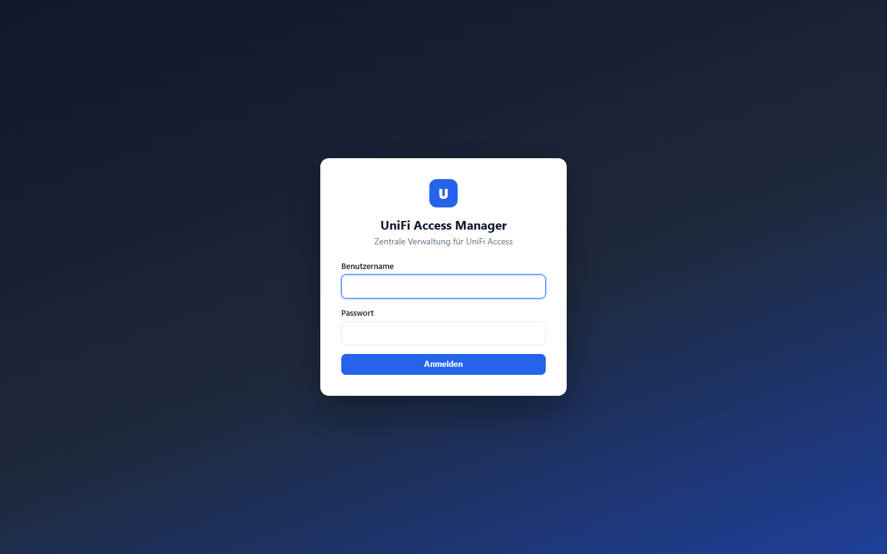

---

## Dashboard

Das Dashboard ist die Startseite nach der Anmeldung und zeigt eine kompakte
Übersicht:

- **Kennzahlen** als Kacheln: Standorte, Personen, Karten/Medien, freie
  Karten, Zutrittsgruppen, Türen und lokale Benutzer. Jede Kachel verlinkt
  auf den jeweiligen Bereich.
- **Standorte-Tabelle** mit den Kennzahlen je Standort.
- **Letzte Synchronisationen** mit Zeitpunkt, Status und Ergebnis.

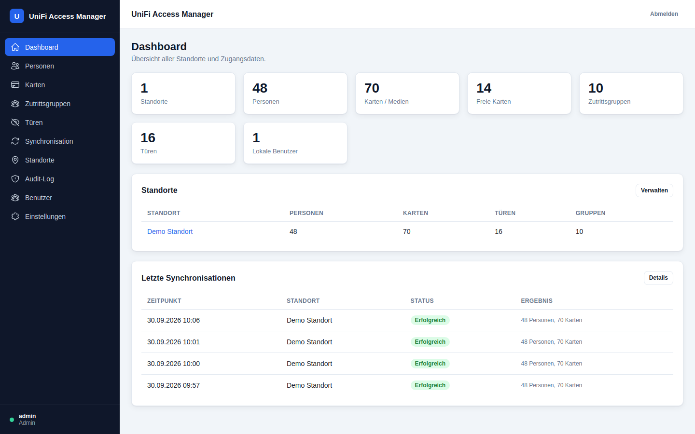

---

## Personen

Die Personenliste zeigt den lokalen Cache aller UniFi-Benutzer über alle
Standorte hinweg. Die Tabelle enthält Name, E-Mail, Standort,
Mitarbeiternummer, zugewiesene Karten und Status (Aktiv / Ausstehend /
Deaktiviert).

Über die Filterleiste lässt sich die Liste nach Standort, Suchbegriff (Name,
E-Mail, Nummer, Karte), Status, Karten-Zuordnung und Sortierung eingrenzen.
Administratoren und Operatoren können über **Neue Person** eine Person
anlegen; über **CSV exportieren** wird die Liste als CSV heruntergeladen.

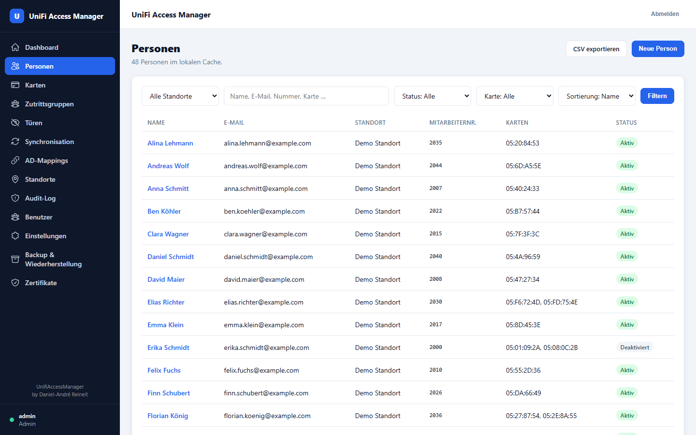

---

## Personendetail

Ein Klick auf eine Person öffnet die Detailansicht mit drei Bereichen:

- **Stammdaten** – Vorname, Nachname, E-Mail, Mitarbeiternummer, PIN-Code,
  Status und letzte Synchronisation.
- **Zutrittsgruppen** – Zuweisung der Person zu einer oder mehreren
  Zutrittsgruppen per Checkbox.
- **Karten / Zugangsmedien** – zugewiesene Karten inkl. Typ und Status.
  Freie Karten können hier direkt zugewiesen bzw. vorhandene Karten entfernt
  werden.

Administratoren können zusätzlich die **Rohdaten** (UniFi) einsehen sowie die
Person **Bearbeiten** oder **Löschen**.

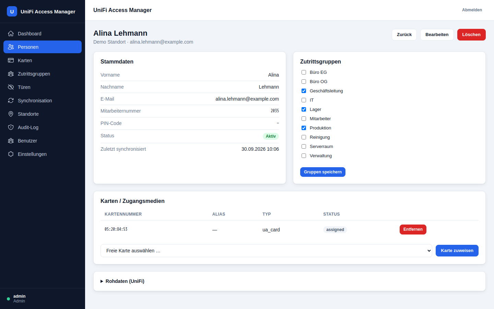

---

## Karten & Zugangsmedien

Diese Seite listet alle RFID-Karten bzw. Zugangsmedien mit Kartennummer,
Alias, Typ, Status, Standort und – sofern zugewiesen – der zugehörigen
Person. Über die Filter lässt sich nach Standort, Suchbegriff und
Zuweisungsstatus (zugewiesen / frei) filtern. **CSV exportieren** erzeugt
einen CSV-Download.

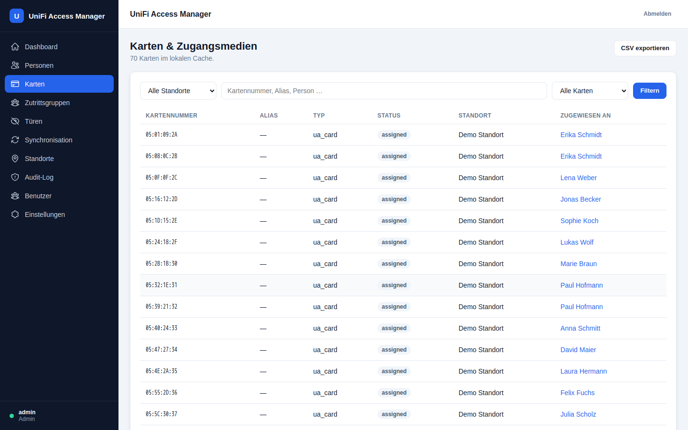

---

## Zutrittsgruppen

Zutrittsgruppen entsprechen den UniFi *Access Policies*. Die Tabelle zeigt
Name, Standort, Mitgliederzahl und die zugeordneten Türen. Administratoren
und Operatoren können Gruppen über **Neue Gruppe** anlegen (inkl.
Tür-Zuordnung) sowie bestehende Gruppen bearbeiten oder löschen.

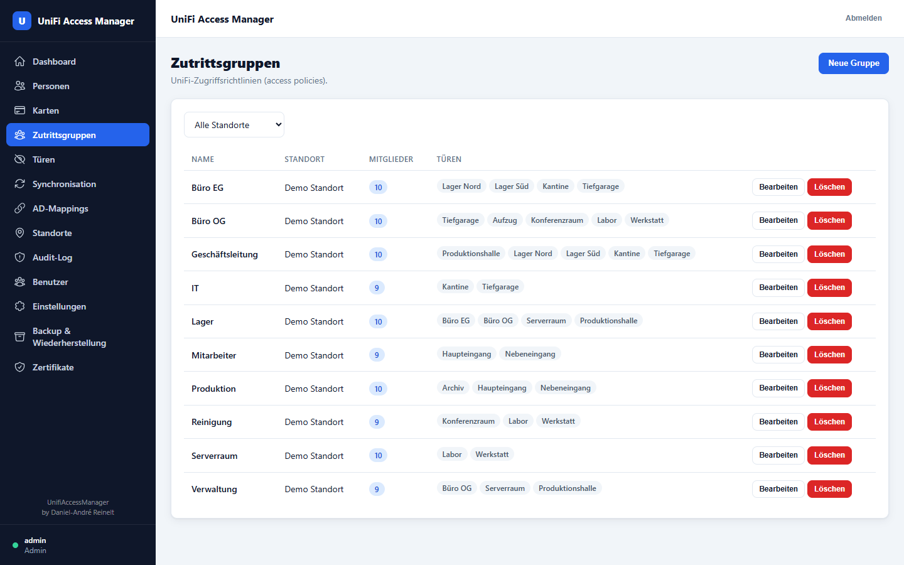

---

## Türen

Die Türliste zeigt alle Türen pro Standort mit Typ und Schlossstatus
(verriegelt / entriegelt). Administratoren und Operatoren können eine Tür über
**Öffnen** per Fernöffnung (*unlock*) entriegeln.

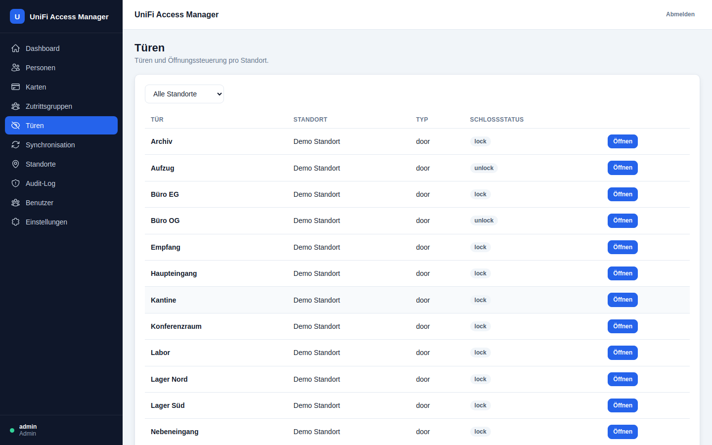

---

## Standorte

Ein Standort entspricht einem UniFi-Controller. Die Liste zeigt Name, Host,
Status sowie die gecachten Kennzahlen (Personen, Karten, Türen, Gruppen).
Über **Neuer Standort** wird ein Controller mit Host, Port und API-Token
hinterlegt (der Token wird AES-256-GCM-verschlüsselt gespeichert). Mit
**Test** lässt sich die Verbindung prüfen, über **Bearbeiten** der Standort
ändern und über **Löschen** samt Cache entfernen.

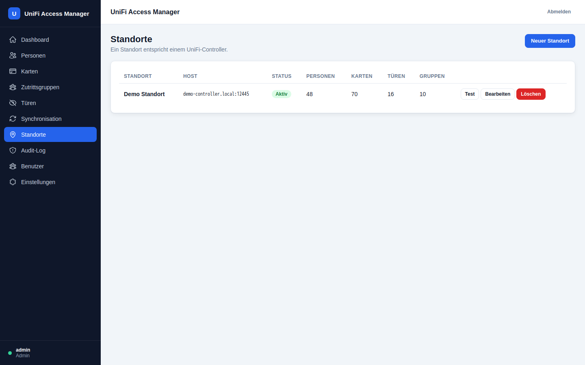

---

## Synchronisation

Die Synchronisation überträgt die Daten aller Controller in den lokalen
Cache. Die Seite zeigt den letzten erfolgreichen bzw. fehlgeschlagenen Lauf
sowie den Verlauf mit Status, Nachricht und Statistik (Personen, Karten,
Gruppen, Türen). Über **Jetzt synchronisieren** wird der Abgleich manuell
angestoßen; zusätzlich läuft er periodisch über den Cron-Container.

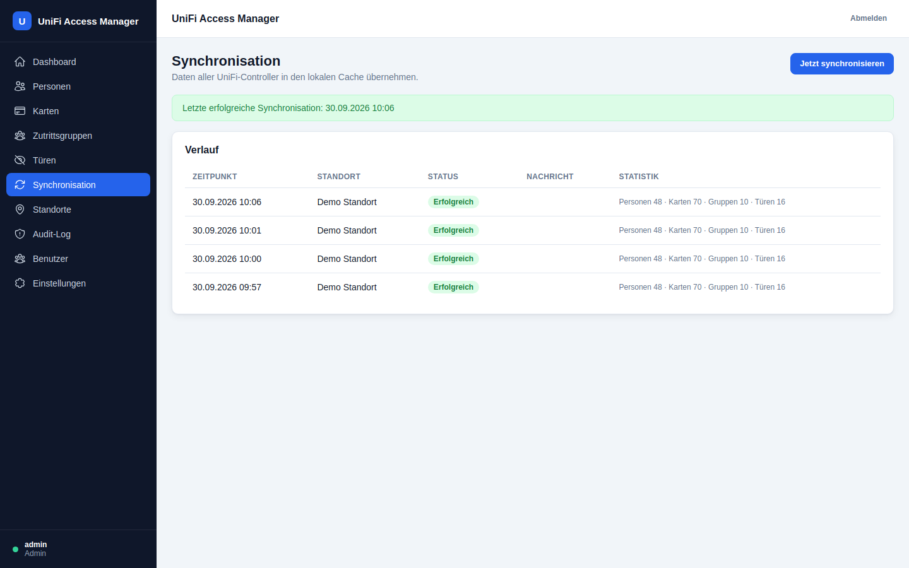

---

## AD-Mappings

Hier werden Active-Directory-Gruppen mit UniFi-Zutrittsgruppen verknüpft.
Beim AD-Sync erhalten die Mitglieder der AD-Gruppe automatisch die
Zutrittsrechte der zugeordneten Zutrittsgruppe.

- **Neue Zuordnung** legt eine Verknüpfung AD-Gruppe → Zutrittsgruppe (je
  Standort) an.
- **Jetzt synchronisieren** führt den AD-Abgleich manuell aus.
- Der Bereich **Abweichungen** listet Personen, die in Access berechtigt
  sind, aber in keiner gemappten AD-Gruppe stecken; sie können als CSV
  exportiert werden.

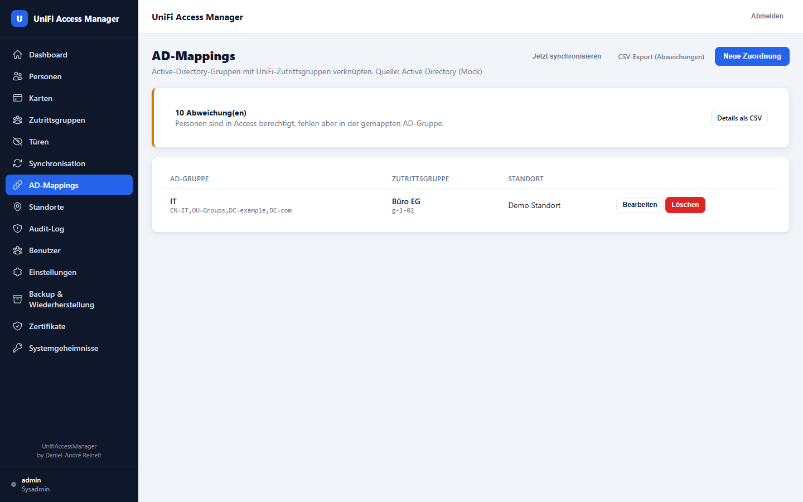

---

## Audit-Log

Das Audit-Log protokolliert alle Änderungen und Zugriffe revisionssicher:
Zeitpunkt, Benutzer, Aktion, betroffenes Objekt, Ergebnis und Details. Die
Suche filtert nach Aktion, Person oder Benutzer; **CSV exportieren** lädt das
Log als CSV herunter.

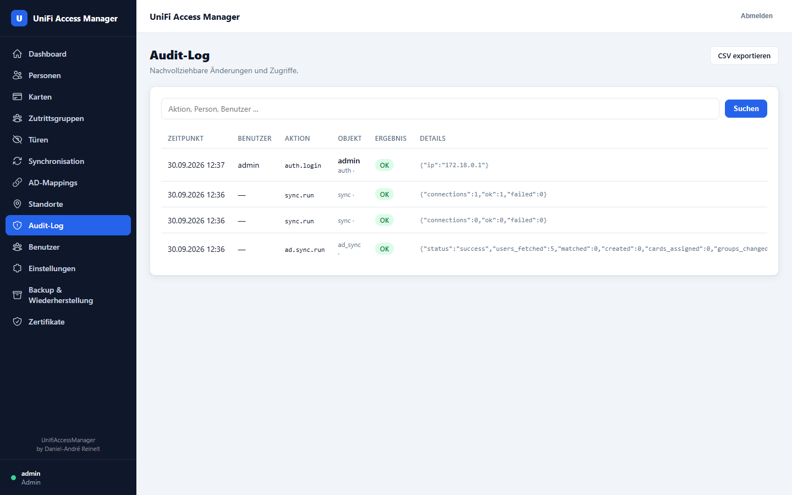

---

## Benutzer

Verwaltung der lokalen Anmeldekonten. Die Tabelle zeigt Benutzername, E-Mail,
Rolle, Status und letzten Login. Über **Neuer Benutzer** werden Konten mit
Rolle und Passwort (min. 10 Zeichen) angelegt; bestehende Konten lassen sich
bearbeiten (Rolle, E-Mail, Passwort, Aktiv-Status) oder löschen.

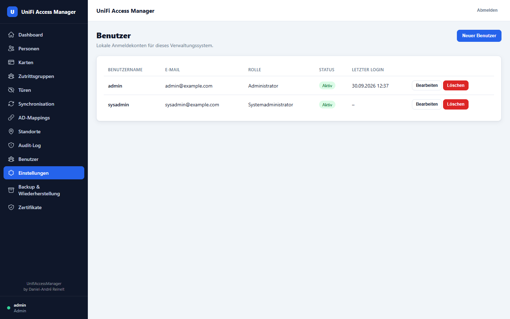

---

## Backup & Wiederherstellung

Sichert alle Einstellungen sowie die gecachten UniFi-Daten als
unverschlüsseltes JSON-Archiv und spielt sie bei Bedarf wieder ein.

- **Sofort-Backup** – lädt ein JSON-Archiv direkt herunter oder legt es im
  Ordner `storage/backups` ab.
- **Automatische Backups** – per Cron geplant; Intervall und Aufbewahrung
  (Anzahl Archive) sind konfigurierbar.
- **Gespeicherte Archive** – Liste aller abgelegten Archive mit Download und
  Löschen.
- **Wiederherstellung** – eine `.json`-Datei hochladen, Vorschau anzeigen und
  die Wiederherstellung ausdrücklich bestätigen (ersetzt Einstellungen und
  Cache vollständig).

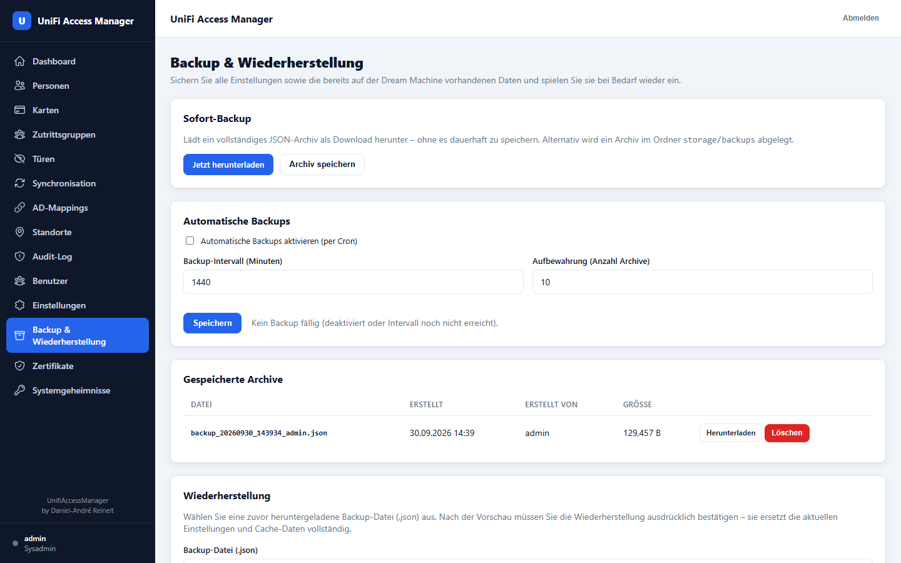

---

## Zertifikate

Verwaltung des HTTPS-Zertifikats der Web-Oberfläche:

- **Status** – zeigt, ob ein echtes Zertifikat oder das selbstsignierte
  Notfall-Zertifikat ausgeliefert wird, inkl. Hostname, Aussteller und
  Gültigkeit.
- **Request erstellen** – erzeugt einen CSR (Certificate Signing Request) mit
  Common Name, SANs und weiteren Feldern.
- **Zertifikat importieren** – signiertes Zertifikat (PEM mit Kette) als
  Datei oder Text einfügen, mit Vorschau vor der Übernahme.
- **Requests & Zertifikate** – Übersicht mit Aktivieren / Deaktivieren /
  Löschen.

Solange kein gültiges Zertifikat aktiv ist, bleibt HTTPS über das
Notfall-Zertifikat immer verfügbar.

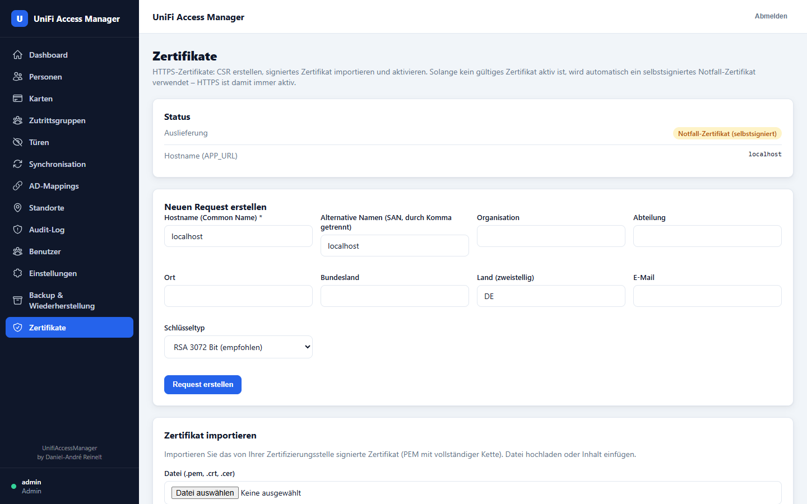

---

## Einstellungen

Zeigt die Anwendungskonfiguration (Name, Debug-Modus, Mock-Modus, Zeitzone,
PHP-Version) und erlaubt die Konfiguration der automatischen Synchronisation
(aktivieren/deaktivieren, Intervall in Minuten). App-Name, Debug- und
Mock-Modus werden über die Umgebungsvariablen (`.env`) gesteuert und können
hier nicht geändert werden.

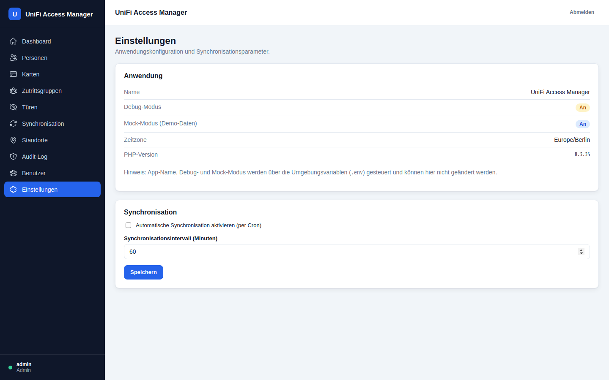

---

## Systemgeheimnisse

Nur für die Rolle **Systemadministrator** sichtbar. Hier werden vertrauliche
Systemdaten verwaltet – Active-Directory-Daten, DNs und API-Endpunkte. Die
Werte werden AES-256-GCM-verschlüsselt gespeichert und nur auf explizites
**Anzeigen** entschlüsselt. Jede Anzeige und Änderung wird im Audit-Log
protokolliert. Kategorien: *Active Directory*, *LDAP / DN*, *UniFi API* und
*Sonstiges*.

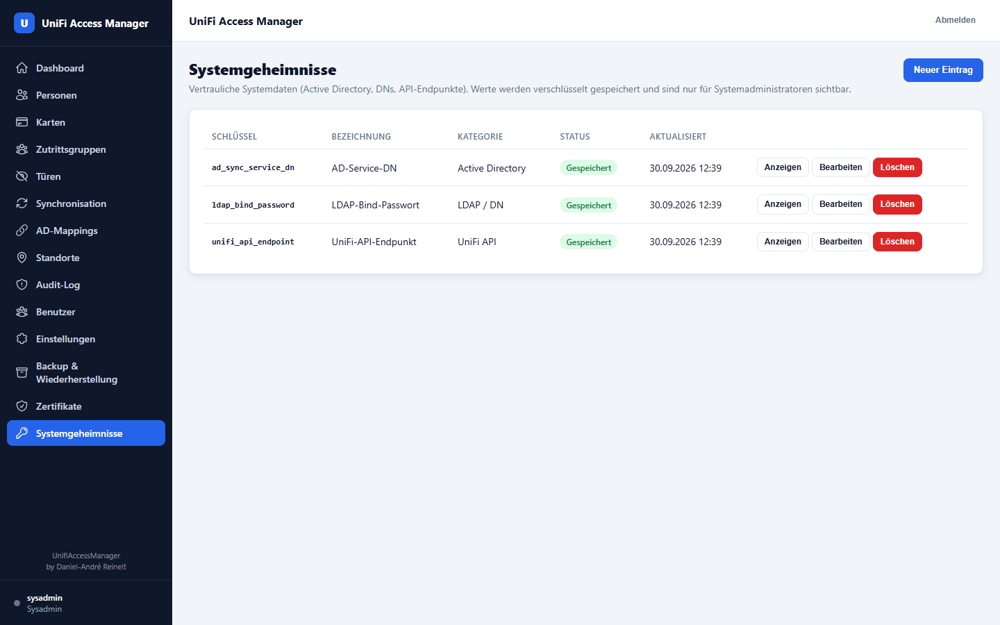

---

## CSV-Export

Mehrere Bereiche lassen sich als CSV exportieren:

| Bereich | URL | Inhalt |
|---------|-----|--------|
| Personen | `/export/persons` | Personenliste (`personen.csv`) |
| Karten | `/export/credentials` | Kartenliste |
| Audit-Log | `/export/audit` | Audit-Einträge |
| AD-Abweichungen | `/export/ad-non-compliance` | Nicht konforme Personen |

Die Exporte erfordern eine angemeldete Session und respektieren die
Rollenberechtigungen des jeweiligen Bereichs.
